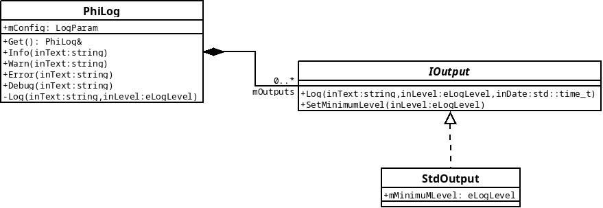

# PhiLog
Simple C++ logger

## Overview
Philog use a singleton accessible from PhiLog.hpp. It allows you to write debug, info, warn and error logs and filter them with a minimum level.
You can also configure multiple outputs of different types (only std output for now)

Philog is also thread safe

